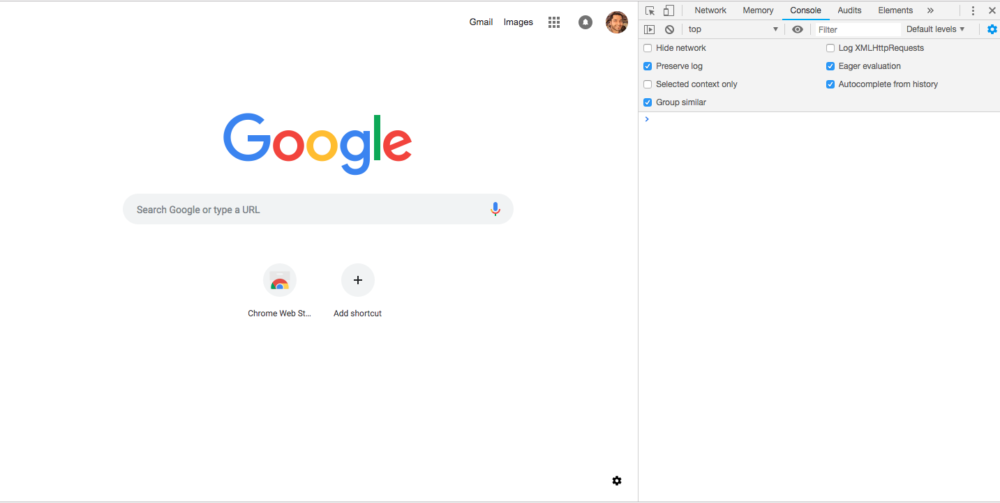

# Introduction to web3 and Ethereum (Alternate activity)
## Goal
**To be done only if there are any issues with getting web3 to install.** In this activity, we will read basic account information from both local and public blockchains and execute a basic transfer of the ether (ETH) cryptocurrency using MetaMask's injected web3 instance. 

## Exercise
This activity will require you to:
* Use web3js - a collection of libraries to interact with local or remote ethereum nodes
* * Interact with MetaMask - a browser extension for accessing Ethereum based DApps 
* Run a local ethereum blockchain using Ganache
* Interact with the local blockchain through web3js functions and work with promises and basic callbacks
* Send ETH cryptocurrency between 2 accounts

### Setup
> Ensure you have Ganache running a local blockchain at `http://127.0.0.1:7545`.

> Download the MetaMask browser extension in Chrome (https://metamask.io/) if you have not already done so.

Now we will connect MetaMask with our local blockchain. 

> Open up the MetaMask extension and *Import using account seed phrase*. The phrase will be the mnemonic from Ganache. 


>Then from the list of networks, select `Custom RPC`. Here, set the *New RPC URL* to `http://127.0.0.1:7545`


>**Note:** While all 10 of your local Ganache blockchain accounts should load automatically, you may only end up with just the first account and you will have to add additonal accounts manually using the *Import Account* function.


> Open up the console in Chrome:



> MetaMask automatically injects its instance of web3 into the browser. You can access it in the console simply with:
``` 
    > web3
```

### The web3 object
Because we are using a third party's web3 instance, the current web3 release documentation can be found at https://github.com/ethereum/wiki/wiki/JavaScript-API.

Key attributes or functions of web3 include:
* `unitMap` object - wei, gwei, ether values and units
* `web3` object functions `toWei` and `fromWei` for unit conversions and `toHex` to convert to hexadecimal.
* The `web3.eth` object and in particular the `getAccounts` `getBalance` and `sendTransaction`  functions

### Get Account Balance

Now let us get the balance of one of the local accounts. Function calls to the blockchain return **promises** so we can invoke callback functions which execute after the promise has been fulfilled. 

> From your local blockchain, select the address of the first account. E.g. `0xdeF4f71e2DA944Ca4118c04CcF120f8a2bc7B92B`. Then call the `getBalance` function in the `web3.eth` object:
```
    > web3.eth.getBalance (
        '0xdeF4f71e2DA944Ca4118c04CcF120f8a2bc7B92B', function(err, wei) {
        balance = web3.fromWei(wei, 'ether')
    })

    > balance.toString()
```
Note that the response from the function call is a Promise which resolves to the balance of the first account - 100 ETH. 

Currently we are using a local blockchain but we can do exactly the same thing with the public ethereum testnet. 

> From MetaMask, select the `Ropsten Test Network`. The go to https://ropsten.etherscan.io/accounts for a ranked list of the highest balance accounts. 
> Pick one of the accounts and use web3 in the console to obtain the balance as above. 

And the balance we get should match the balance displayed on the etherscan accounts webpage. 

### Send ETH between accounts

Finally, back to our local blockchain, let us send ETH from one account to another representing a basic money transfer between wallets. 


From the web3js docs (https://web3js.readthedocs.io/en/1.0/web3-eth.html#eth-sendtransaction), the `sendTransaction` function takes in a transaction object containing the to/from addresses, transaction value in Wei and optional parameters like gas/gasPrice which we won't worry about at the moment. 

> Call the `sendTransaction` function passing in the transaction object:
```
    > web3.eth.sendTransaction({
        from: '0xdeF4f71e2DA944Ca4118c04CcF120f8a2bc7B92B',
        to: '0x20eCfb735EEAd9902b43Cd553F485Fd7a04D2791',
        value: web3.toWei('10', 'ether')
    })
```
This, as expected, returns a promise. Taking a look at the account summaries of our local blockchain in Ganache, we see the first account balance has been reduced by 10 ETH and the second account balance has increased by 10 ETH. **We have successfully excuted our first money transfer!**