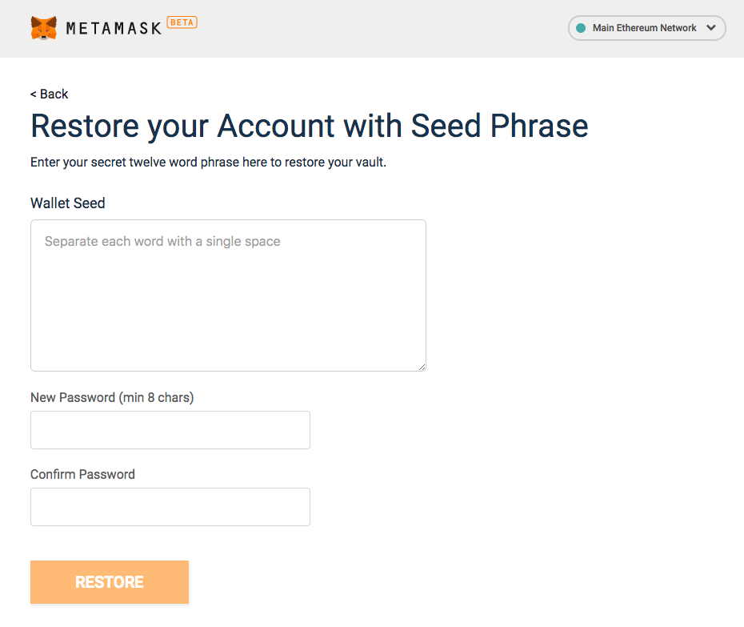
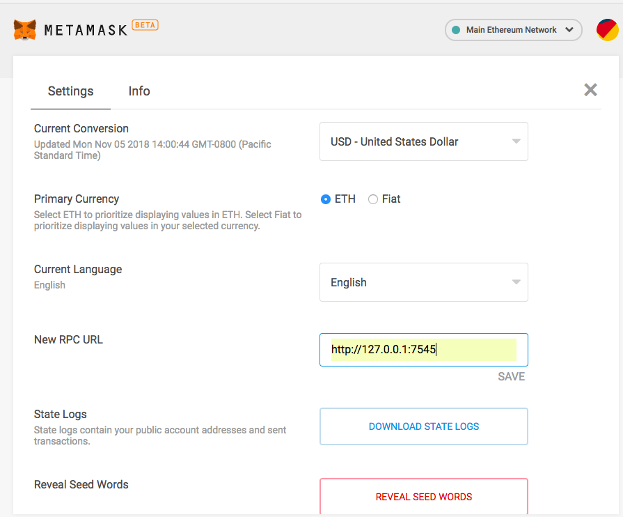
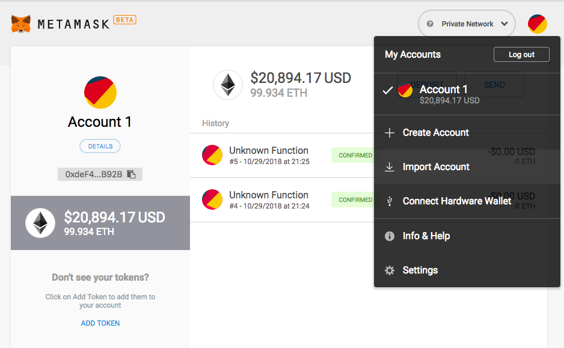
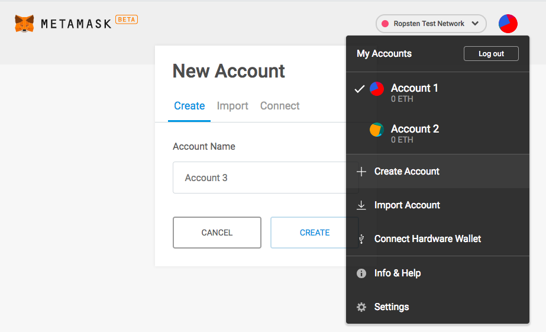
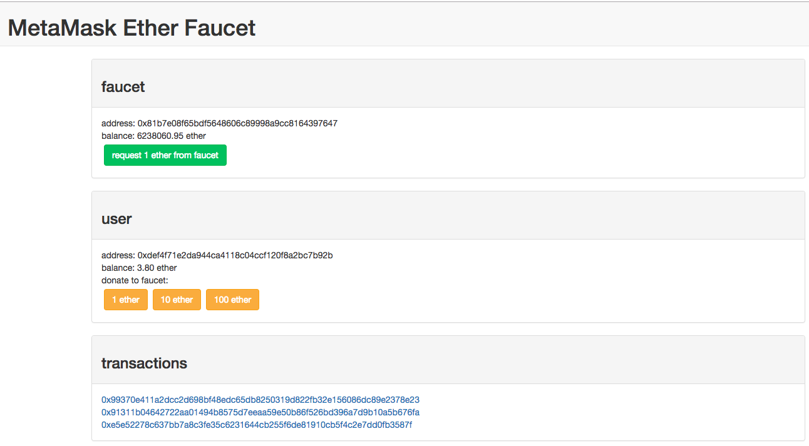

# Ethereum transactions using MetaMask
## Goal
In this activity, we will use the popular MetaMask Chrome browser extension to authorize an ETH transfer between two Ethereum accounts on the **client-side**, on both a local and public Ethereum blockchain.

## Exercise
This activity will require you to:
* Interact with MetaMask - a browser extension for accessing Ethereum based decentralized applications - only for getting test accounts and ETH setup. 
* Use web3.js to interact between a local blockchain network and a web front-end 
* Use HTML and JavaScript templates for a front-end web application
* Interact with the `Ropsten` Ethereum test network to send a ETH transfer
* Use https://ropsten.etherscan.io/ to see the details of your transaction

### Setup
> In the `activity2/sample-app/` folder, run:
```
    npm install
```
This will install all the node dependencies for this basic front-end app. 

> Ensure you have Ganache running a local blockchain at `http://127.0.0.1:7545`.

> Download the MetaMask browser extension in Chrome (https://metamask.io/) if you have not already done so.

Now we will connect MetaMask with our local blockchain. 

> Open up the MetaMask extension and *Import using account seed phrase*. The phrase will be the mnemonic from Ganache. 



>Then from the list of networks, select `Custom RPC`. Here, set the *New RPC URL* to `http://127.0.0.1:7545`



>**Note:** While all 10 of your local Ganache blockchain accounts should load automatically, you may only end up with just the first account and you will have to add additonal accounts manually using the *Import Account* function.

   


### Front-end Setup
The `sample-app/` folder contains the boilerplate code for a very simple app. The front-end code, located in `src/` folder consists of HTML/CSS and JavaScript.

The focus for this part of the activity will be on the JavaScript code in `src/js/app.js`. 

Notice in our `package.json` that we have `lite-server` installed under the `dev` script, which will be used to run our sample app locally. 

> To get the sample app up and running using `lite-server`, run:
```
    npm run dev
```
> Now direct your browser to `http://localhost:3000` to see the App up and running!

### app.js code
The code in `app.js` should look like this:
```
App = {
  web3Provider: null,

  init: function() {
    return App.initWeb3();
  },

  initWeb3: function() {
    if (typeof web3 !== 'undefined') {
      // If a web3 instance is already provided by MetaMask.
      App.web3Provider = web3.currentProvider;
      web3 = new Web3(web3.currentProvider);
    } else {
      // Specify default instance if no web3 instance provided
      App.web3Provider = new Web3.providers.HttpProvider('http://localhost:7545');
      web3 = new Web3(App.web3Provider);
    }
    return App.showActiveAccount();
  },

  showActiveAccount: function() {
    // TODO: Load account data - display active account info on the webpage
    
  },

  // Send money function based on form inputs
  sendMoney: function() {
    //TODO: send money from active account to receiver

  },
};

$(function() {
  $(window).load(function() {
    App.init();
  });
});
```
The first thing to note is the `initWeb3` function which defines the web3 instance to be used by our DApp. When we launch MetaMask, it injects an instance of Web3 into the app running in the browser. If MetaMask is not active, the web3 instance will be our local one. 

For our simple DApp, we will:
1. Show the current active MetaMask account address on the webpage
2. Have a basic form with the receiver address and the amount of ETH to be transferred as inputs. 

### 


### Setup to use the Ropsten Test Network



> Open up MetaMask, change the network to `Ropsten Test Network` and create 2 accounts. We will be using these 2 accounts when sending ETH between them and recording the transaction on the public `Ropsten` network. 

> Send some test ETH to your Account1 address using https://faucet.metamask.io/ (make a few requests so that your Account1 has 2 or 3 Ether). Note it will take 20-30 seconds for each transfer to complete.



Recall the reason we need to do this is because any transaction recorded on the Ethereum blockchain requires a gas fee to complete the transaction. 