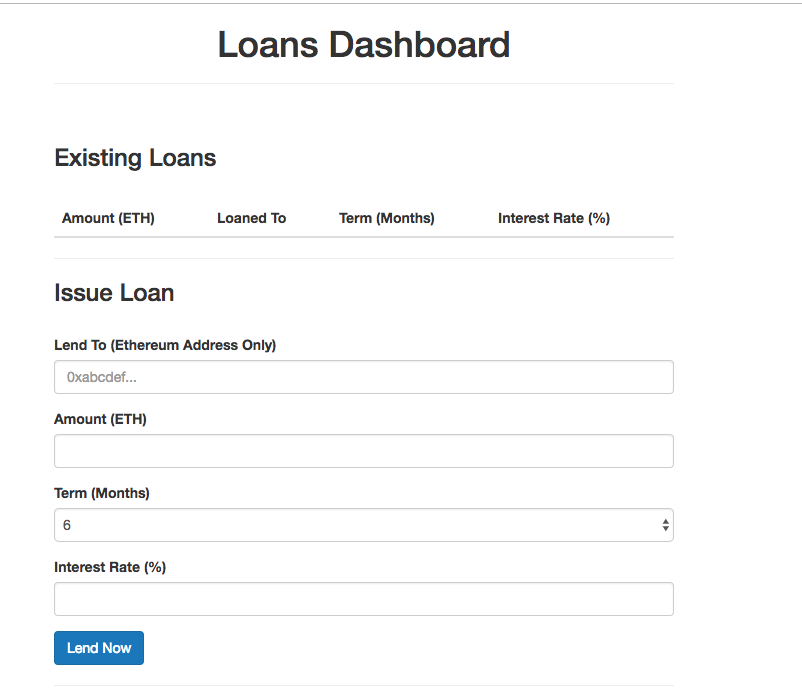
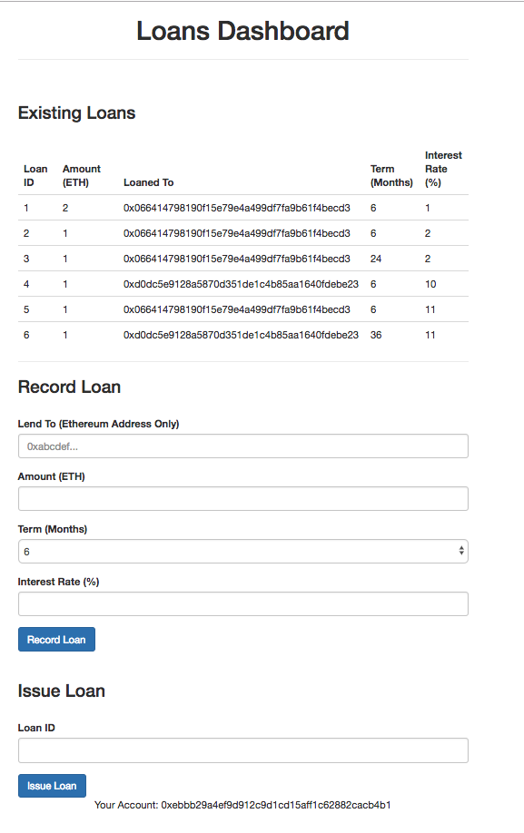

# Create, deploy, and interact with a basic Smart Contract through a web DApp
## Goal
In this activity, we will program a basic Smart Contract, deploy it to a local network and interact with it using a basic front-end. 

## Exercise
This activity will require you to:
* Use Solidity to write a basic smart contract to record a loan
* Use web3.js to interact between a local blockchain network and a web front-end
* Use HTML and JavaScript for the front-end web application

### Setup

> In the `activity3/lending-app/` folder, run:
```
    npm install
```
This will install all the node dependencies. 

> Ensure you have Ganache running a local blockchain at `http://127.0.0.1:7545`.

### Create a Smart Contract

First, we will create the `Lending` contract which will be written in Solidity and stored in the `/contracts` folder. For an introduction to Solidity contracts, check out `https://solidity.readthedocs.io/en/v0.4.24/introduction-to-smart-contracts.html`

> Create a file `Lending.sol` in the `contracts/` folder.

> First, let's add the boilerplate code specifying the version of Solidity for the compiler and the contract name:
```
    pragma solidity ^0.4.24;

    contract Lending {
    
    }
```
Then we want to create a `Loan` object, specific for our web app. When extending a loan, key attributes include: the creditor, debtor, the amount loaned, the duration of the loan and the interest rate being charged. 

> Create a `struct` object with the following attributes:
```
    contract Lending {
        struct Loan {
            address creditor;
            address debtor;
            uint amount;
            uint term; // in months
            uint interest;
        }
    }
```

We want to keep track of all the loans. A simple way to do this is by using a dictionary with a loan ID. 

```
    contract Lending {
        ...

        mapping(uint => Loan) public loans;
        uint public loansCount;
    }
```
By using the keyword `public`, we are able to access the `loans` dictionary and `loansCount` variable in our web app.

>Then we will create a constructor for the `Lending` contract:

```
    contract Lending {
        ...

        constructor () public {

        }   
    }
```

>Finally, we will create the `addLoan` function:
```
    function addLoan(address creditor, address debtor, uint amount, uint term, uint interest) public {
        loansCount ++;
        loans[loansCount] = Loan(creditor, debtor, amount, term, interest);;
    }
```
>Save your `Lending.sol` contract and create a file `2_deploy_contracts.js` in the `migrations/` folder.

The files in the `migrations/` folder will deploy the contracts onto the blockchain. 

>Copy and adapt the code in the default `1_initial_migration.js` file to deploy the `Lending` smart contract:
```
    const Lending = artifacts.require("./Lending.sol");

    module.exports = function(deployer) {
        deployer.deploy(Lending);
    };
```
Now we are ready to compile our contract and deploy to our blockchain using `truffle`. Note the network specified in `truffle.js` to correspond to the IP and port of our local blockchain. 

>From within `activity3/lending-app/` run the following from the Terminal:
```
    truffle compile
```
This will compile and build your contract artifacts in a folder called `build/`. 

>Then to deploy the contracts on the local blockchain, run:
```
    truffle migrate
```
You should see each contract deployed with a hash address in your Terminal output. 

In addition, you should also see the first account in Ganache have slightly less than 100ETH as a small amount of ETH was used as a gas fee to transact with the local network.

So we have now created our Lending smart contract and deployed it to our local blockchain.

### Front-end Setup with MetaMask
In order to interact with our Lending smart contract, we will work with a basic front-end consisting of HTML/CSS and JavaScript. We will use Bootstrap for our CSS. 

The focus for this part of the activity will be on the JavaScript code in `src/js/app.js`. 

Notice in our `package.json` that we have `lite-server` installed under the `dev` script, which will be used to run our Lending app locally. 

> To get the Lending app up and running using `lite-server`, run:
```
    npm run dev
```
> Now direct your browser to `http://localhost:3000` to see the Loans Dashboard.

You will notice that the web page indicates it is loading, but no content appears because we need to first connect the front-end application with our local blockchain. We will do this by setting up the MetaMask chrome extension, similar to what we did in Activity 2.

> Open up the MetaMask extension and *Import using account seed phrase*. The phrase will be the mnemonic from Ganache. 


>Then from the list of networks, select `Custom RPC`. Here, set the *New RPC URL* to `http://127.0.0.1:7545`


>**Note:** While all 10 of your local Ganache blockchain accounts should load automatically, you may only end up with just the first account and you will have to add additonal accounts manually using the *Import Account* function. 


>Once MetaMask is properly configured, you should see your web application load.


### Front-end HTML code
> Look through `src/index.html` which is a basic template for our Lending app. Note in particular:
* The `loader` and `content` divs
* The function called on form submission
* The components of the form
* The `accountAddress` info after the form

### Configure app.js
The scaffolding code for our `app.js` looks like the following which runs the web app upon window load and initiates and sets the web3 provider:
```
App = {
  web3Provider: null,
  contracts: {},
  account: '0x0',

  init: function() {
    return App.initWeb3();
  },

  initWeb3: function() {
    if (typeof web3 !== 'undefined') {
      // If a web3 instance is already provided by MetaMask.
      App.web3Provider = web3.currentProvider;
      web3 = new Web3(web3.currentProvider);
    } else {
      // Specify default instance if no web3 instance provided
      App.web3Provider = new Web3.providers.HttpProvider('http://localhost:7545');
      web3 = new Web3(App.web3Provider);
    }
    return App.initContract();
  },

  initContract: function() {
    $.getJSON("Lending.json", function(lending) {
      // Instantiate a new truffle contract from the artifact
      App.contracts.Lending = TruffleContract(lending);
      // Connect provider to interact with contract
      App.contracts.Lending.setProvider(App.web3Provider);

      return App.render();
    });
  },

  render: function() {
    let lendingInstance;
    const loader = $("#loader");
    const content = $("#content");

    loader.hide();
    content.show();
    //TODO: Render content on webpage
  },

  createLoan: function() {
      //TODO: Create the loan
  },

  issueLoan: function() {
      //TODO: Issue the loan by transferring ETH
  }
};

$(function() {
  $(window).load(function() {
    App.init();
  });
});
```
>Compare what you see here in `app.js` with the code in `index.html`. 

### Create the Loan
For each function in our `App` object in `app.js`, we need to take an instance of the deployed Lending smart contract in order to then apply a smart contract function such as `addLoan(...)`.
```
    App.contracts.Lending.deployed().then(function(instance) {
        // Call instance.addLoan(...) for example
    });
```
Recall that the `addLoan(...)` function in the `Lending` contract takes the following arguments:
* address creditor
* address debtor
* uint amount (in Wei)
* uint term
* uint interest

The creditor will be the account currently logged in by the app user. We can access the account's public address with `App.account`. 

> Grab the form field values and pass them as arguments into the `addLoan(...)` function:
```
createLoan: function() {
    const debtor = $('#debtor').val();
    const loanAmount = $('#loanAmount').val();
    const loanTerm = $('#loanTerm').val();
    const interestRate = $('#interestRate').val();

    // Create the Loan
    App.contracts.Lending.deployed().then(function(instance) {
        return instance.addLoan(App.account, debtor, web3.toWei(loanAmount, 'ether'), loanTerm, interestRate, { from: App.account });
    }).catch(function(err) {
        console.error(err);
    });
}, 
```
### Issue the Loan
Recall in Activity 1 we used `web3.eth.sendTransaction(...)`function to transfer ETH. We will do the same here. 

**Note:** Because will be using our local (i.e. unlocked) blockchain, and later MetaMask which holds our account private keys to sign transactions, we can use `web3.eth.sendTransaction(...)`. However, if we do not use MetaMask's injected web3 instance and we still want to transact over the Ethereum testnet or mainnet, we will need to build, sign and broadcast our transaction as we did in Activity 2. 

> Instead of using `.then(function(...))` to resolve our Promise and execute our callback as we did in `createLoan()`, we will use the `async/await` special syntax in JavaScript EC6 (https://javascript.info/async-await) to deal with Promises without creating long Promise chains:  
```
    issueLoan: async function() {
    const loanID = $('#issueLoan').val();
    
    // Retrieve the loan
    const ins = await App.contracts.Lending.deployed();
    const loan = await ins.loans(loanID);

    web3.eth.sendTransaction({
        from: loan[0],
        to: loan[1],
        value: loan[2]
      }, function(err, txnHash) {
        if (!err) {
          console.log('txnHash is ' + txnHash);
        }
      });
  },
```
> Compare and contrast the `Promise.then(function(err, result) {...})` approach with using `async/await`. 

### Render Lending data on webpage
Now let's complete our `render` function in `app.js`.
```
render: function() {
    let lendingInstance; 
    const loader = $("#loader");
    const content = $("#content");

    loader.hide();
    content.show();
    //TODO: Render content on webpage
},
```
>First switch the loader to `show()` and the content to `hide()` which is the correct rendering order. 
```
    ...
    loader.show();
    content.hide();
    //TODO: Render content on webpage
    ...
```

>Then let us add the active account's information at the bottom of the webpage in the html paragraph with id `#accountAddress`. One way to get the active account is by calling the async function `web3.eth.getCoinbase(...)` which takes in a callback using the address of the active client as the result:
```
    web3.eth.getCoinbase(function(err, result) {
      if (err === null) {
        App.account = result;
        $("#accountAddress").html("Your Account: " + result);
      }
    });
```
>Then, we want to take an instance of the Lending contract and access the total number of Loan objects with the `loansCount` variable.
```
    App.contracts.Lending.deployed().then(function(instance) {
      //Assign instance to a variable to access it later in our callback
      lendingInstance = instance;
      return lendingInstance.loansCount();
    }).then(function(loansCount) {
      let loanString = '';
      let promises = [];

      // Loop through to retrieve each Loan object. Remember we will only get back a Promise, not the actual object.

      // Extact each Loan object after the Promise resolves and render the `loanString`.

      loader.hide();
      content.show();
    }).catch(function(error) {
      console.warn(error);
    });
```
> Then, fill out the loop code to iterate through each loan Promise from the first to `loansCount` and place the Promise in the `promises` array. 
```
 ...

    for (let i = 1; i <= loansCount; i++) {
        promises.push(lendingInstance.loans(i));
    }

    // Extact each Loan object after the Promise resolves and render the `loanString`.

```
> Finally, resolve all the Promises and then loop through and extract each Loan object. We also only want to render the list of loans where the active user (i.e. `App.account`) is the creditor. 
```
    App.contracts.Lending.deployed().then(function(instance) {
      lendingInstance = instance;
      return lendingInstance.loansCount();
    }).then(function(loansCount) {
      let loanString = '';
      let promises = [];

      for (let i = 1; i <= loansCount; i++) {
        promises.push(lendingInstance.loans(i));
      }

      Promise.all(promises).then(function(loans){
        loans.forEach(function(loan, i) {
          if (loan[0] == App.account) {
            let loanID = i + 1;
            let debtor = loan[1];
            let amount = loan[2];
            let term = loan[3];
            let interest = loan[4];

          // Render existing loans table
          loanString += ("<tr><td>" + loanID + "</td><td>" + web3.fromWei(amount, 'ether') + "</td><td>" + debtor + "</td><td>" + term + "</td><td>" + interest + "</td></tr>");
          }
        });

        $('#loans').html(loanString);
      });
      loader.hide();
      content.show();
    }).catch(function(error) {
      console.warn(error);
    });
```
That's it! Your Lending DApp is ready to go! Try to record a loan to another address. For each record, you will need to accept the gas fee for the transaction in MetaMask (it should prompt you automatically through a pop-up). 

When you switch MetaMask accounts, you should only see the existing loans where your current account is the 'creditor'.

Then try and formally 'issue' a loan by using the Loan ID. As above, for each ETH transfer, you will need to approve the gas fee for the transaction in MetaMask (it should prompt you automatically through a pop-up). If loan amount is more than the amount of ETH you have in your account, you'll get an _Insufficient Funds_ error message.




