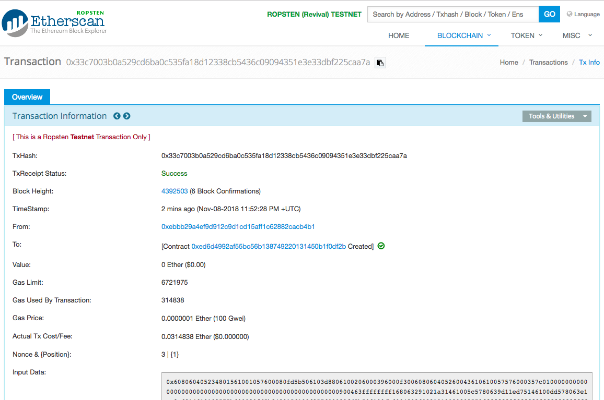

# Deploy and interact with your Lending DApp on a public test network
## Goal
In this activity, we will deploy our lending Smart Contract from the previous activity to the public Ropsten network and interact with it using our web DApp. 

## Exercise
This activity will require you to:
* Use Truffle's `HDWalletProvider` and Infura (https://infura.io) to deploy your smart contract to the public `ROPSTEN` test network
* Use the specialized `ethereumjs-tx` library(https://github.com/ethereumjs/ethereumjs-tx/blob/master/docs/index.md) as in Activity 2 to build, sign and broadcast an ETH transaction issued by the front-end DApp.

### Setup
> You will need to install Truffle's `HDWalletProvider` and configure it in your `truffle.js` file. Installaction and configuration instructions can be found here: https://truffleframework.com/tutorials/using-infura-custom-provider#configure-your-truffle-project. Remember to do this in your `lending-app` folder. Note: you will also need your Infura Ropsten API key/token again.
> Your Ropsten network definition in `truffle.js` should look something like this:
```
var HDWalletProvider = require("truffle-hdwallet-provider");
var mnemonic = "account mnemonic words here..."; // In practice, DON'T do this! As we did in Activity 2, save your mnemonic as an environment variable and retrive using 'process.env.mnemoni' for example. 

module.exports = {
  // See <http://truffleframework.com/docs/advanced/configuration>
  // for more about customizing your Truffle configuration!
  networks: {
    development: {
      host: "127.0.0.1",
      port: 7545,
      network_id: "*" // Match any network id
    },
    ropsten: {
      provider: function() {
        return new HDWalletProvider(mnemonic, 'https://ropsten.infura.io/v3/182b941b70e6443b8854cc53786a3007')
      },
      network_id: 3
    }
  }
};
```

> Ensure your Ropsten Account1 has some Ether. If not, acquire some using https://faucet.metamask.io/.

### Deploy the contract
> Deploy to the Ropsten network with:
```
    truffle migrate --network ropsten
```
This will likely take around a minute. You should see a Terminal output that looks something like:
```
Using network 'ropsten'.

Running migration: 1_initial_migration.js
  Deploying Migrations...
  ... 0xfe3e02ce61f9bec129aaa4061629abb4ea14a0a042793b1b464a692e0cc01899
  Migrations: 0xabd141bc125716ed34cebd7de01041de322cfc3b
Saving successful migration to network...
  ... 0x1ec7e0c87fd6915832b9283a87c8eedb5bc1f634b098a294a59f3d70c2daef9f
Saving artifacts...
Running migration: 2_deploy_contracts.js
  Deploying Lending...
  ... 0x33c7003b0a529cd6ba0c535fa18d12338cb5436c09094351e3e33dbf225caa7a
  Lending: 0xed6d4992af55bc56b138749220131450b1f0df2b
Saving successful migration to network...
  ... 0x38b6d7c895e0367e480907ff30c39ec6233cc55bc5f60da10433e0b1bdeb2665
Saving artifacts...
```

> Check that the contracts have been deployed by searching the transaction hash on https://ropsten.etherscan.io/ . The transaction hash for the Lending contract is `0x33c7003b0a529cd6ba0c535fa18d12338cb5436c09094351e3e33dbf225caa7a` and the address of the contract is `0xed6d4992af55bc56b138749220131450b1f0df2b`.



**Great work!** You have successfully deployed your Lending smart contract on the public Ropsten test network!


