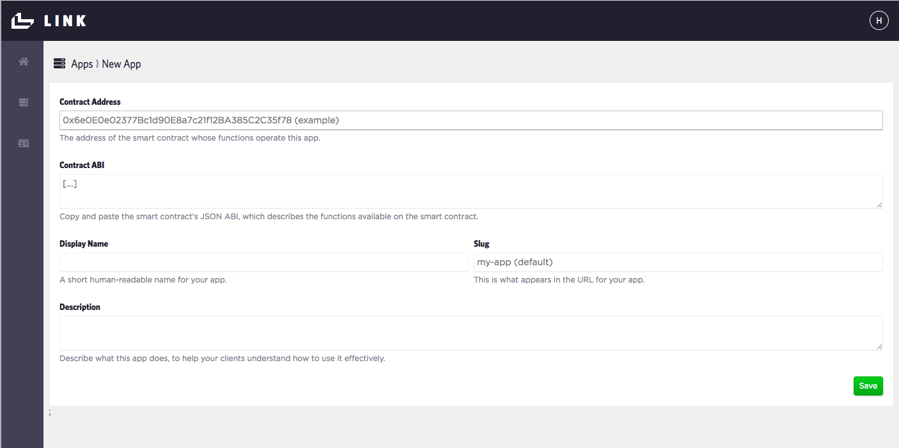
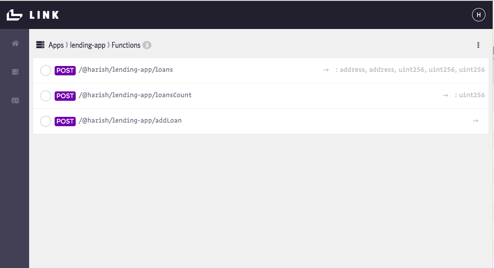
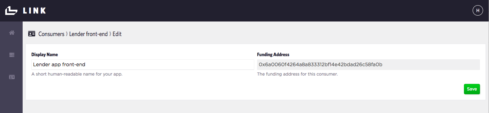
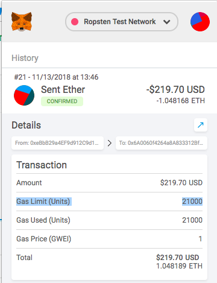
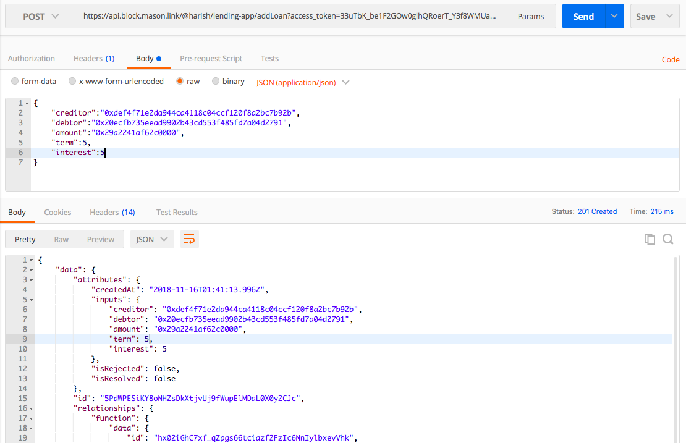

# Refactor your Lending App to use Blockmason Link
## Goal
In this activity, we will use Link - a smart contract API wrapper to refactor our Lending app's `createLoan()` function. 

**Note:** Link is still in early stage beta and so its setup and use will not be as streamlined as we intent it to be in the near future. But you get the first peek! 

## Exercise
This activity will require you to:
* Add your Lending smart contract to Link
* Refactor the `createLoan()` function in app.js to use Link
* Compare and contrast the approaches (web3.js vs. Link)

### Link Setup
> Obtain your Link invitation code

> Register with Link at https://mason.link

> We will use the Lending contract you deployed on the Ropsten test network. You will need to copy the hash address the contract was deployed at. If you can't find this, redeploy the contract from `activity3/lending-app` with:
```
    truffle migrate --reset --network ropsten
```
You will see an output that looks like this:
```
Using network 'ropsten'.

Running migration: 1_initial_migration.js
  Replacing Migrations...
  ... 0x3f504da27435d9240f1aa5e37edc6d6f89c2d983d217ef0b57fdb7b54ec34d64
  Migrations: 0xf3924335e08285721d2607e495ba7815133ace84
Saving successful migration to network...
  ... 0x3ead6009b860f403ba001c19828091ee4d29170f1d201fe7326a403d24bd413e
Saving artifacts...
Running migration: 2_deploy_contracts.js
  Replacing Lending...
  ... 0x6b673206fc8d0a4b919b634370f7019bf62d44a887f2b7cc11bd613da185318c
  Lending: 0xc980b32ed01fac955520f390fde005187c4acb8e
Saving successful migration to network...
  ... 0xfc423712b1a3a29c86801f52738187fbb1f405ade30e8484659694509d32a409
Saving artifacts...
```
The Lending contract address in this case is `0xc980b32ed01fac955520f390fde005187c4acb8e`.

> You will also need to copy the Lending contract ABI (https://solidity.readthedocs.io/en/develop/abi-spec.html) into Link which you can obtain from `activity3/lending-app/Lending.json`:
```
{
  "contractName": "Lending",
  "abi": [
    {
      "constant": true,
      "inputs": [],
      "name": "loansCount",
      "outputs": [
        {
          "name": "",
          "type": "uint256"
        }
      ],
      "payable": false,
      "stateMutability": "view",
      "type": "function"
    },
    ...
  ],
  "bytecode":
  ...

```
### App Setup
> In Link, create a new App called `lending-app` and copy the `Contract Address` and `Contract ABI` including the square brackets `[]`. You can also add in a description. 



This creates an app with 3 functions. Note the data types on the right represent the _**return data type(s)**_ of the function call on the left. 



The first function `loans(loanID)` retrieves a `Loan` object that contains the creditor address, debtor address, amount uint, term uint and interest rate uint. Next we have the `loansCount` value which is just an uint. Finally, we have the `addLoan(..)` function which does return anything. 

### Consumers Setup
In Link, _consumers_ represent front-end apps, individuals or anything that will transact with the smart contract on the network. For this activity, create a `lending-app-client` consumer which will be provided with a **Funding Address**. 

> The important thing to take note of here is the **Access Token that will only be displayed once** after you have created your consumer. Copy this Access Token which will be used when making the Link API calls.



> Now this Funding Address needs some test ETH. Open up your MetaMask Account 1 on the Ropsten Test Network and transfer some ETH to your new Funding Address.



### Blockmason Link API documentation
> The API documentation can be found here: https://mason.link/api/

### Constructing the API POST Request
> It is recommended that you download a tool like Postman, or if you prefer to use cURL statements in the Terminal, to help construct the POST request first before we implement the `$.post(), $.ajax()` function in our `app.js`.


Each consumer in Link will use the _**Consumer Access Token**_ you copied before when making requests. Think of this token as the API key which you will need to send as part of the `access_token` request query parameter. For example:
``` 
https://api.block.mason.link/@harish/lending-app/addLoan?access_token=<consumer_access_token>
```

Because we are making POST requests to a remote network, it will take some time for the requests to resolve. Recall in an earlier activity that transactions with the `Ropsten` network would take 20-30 seconds to process. 

The approach with Link for executing POST requests is as follows:
1. The POST request immediately returns a json response object that contains details of the request as well as an `id`.
2. We can query the `id` to see if the request has successfully resolved.

Let's look at this in action as we POST to the `addLoan` function.

> The `addLoan` function takes the following parameters:
* "creditor" : address string
* "debtor" : address string
* "amount" : integer* (or hex string)
* "term": integer (or hex string)
* "interest": integer(or hex string)

The reason for specifying _(or hex string)_ is because eventually everything passed into a Solidity contract function gets serialized before being transacted on the Ethereum network. 

Recall that the `amount` is in Wei which, for 1 ETH is 10^18 Wei. This number is too large to be represented in JavaScript as a raw number. Hence, it needs to be converted into hex string for our POST request. The `term` and `interest` values are small and OK to use as integers. 

> Putting it all together into a cURL statement, we get:
```
curl -X POST -H 'Content-Type: application/json' -d '{ "creditor":"0xdef4f71e2da944ca4118c04ccf120f8a2bc7b92b","debtor":"0x20ecfb735eead9902b43cd553f485fd7a04d2791",
"amount":"0x29a2241af62c0000",
"term":6,
"interest":3
}' 'https://api.block.mason.link/@harish/lending-app/addLoan?access_token=33uTbK_be1F2GOw0glhQRoerT_Y3f8WMUaXqJ9kUREzR' | python -m json.tool
```
Note: By piping the response into a json formatter like `python json.tool`, we get a nicer output.


The response looks like:
```
{
    "data": {
        "attributes": {
            "createdAt": "2018-11-16T01:21:30.353Z",
            "inputs": {
                "creditor": "0xdef4f71e2da944ca4118c04ccf120f8a2bc7b92b",
                "debtor": "0x20ecfb735eead9902b43cd553f485fd7a04d2791",
                "amount": "0x29a2241af62c0000",
                "term": 6,
                "interest": 3
            },
            "isRejected": false,
            "isResolved": false
        },
        "id": "LQ7bzzQY7hFbIB2M4QjUdv85vLHkPFoIKNDLrwHX5m4",
        "relationships": {
            "function": {
                "data": {
                    "id": "hx02iGhC7xf_qZpgs66tciazf2FzIc6NnIylbxevVhk",
                    "type": "function"
                }
            },
            "owner": {
                "data": {
                    "id": "JD66EmDSP2BaA9isk1See6VPKN3rKdYiUd9QExxgzxs",
                    "type": "consumer"
                }
            }
        },
        "type": "invocation"
    },
    "jsonapi": "1.0",
    "meta": {
        "name": "@blockmason/link-api",
        "version": "0.7.0"
    }
}
```
In Postman, the request body and resulting output look like:



> Now to check that the POST request successfully resolved, we use the response's `data.id` identifier, which above is `LQ7bzzQY7hFbIB2M4QjUdv85vLHkPFoIKNDLrwHX5m4` to make a subsequent GET request to the following URL:

```
https://api.block.mason.link/invocations/LQ7bzzQY7hFbIB2M4QjUdv85vLHkPFoIKNDLrwHX5m4?access_token=33uTbK_be1F2GOw0glhQRoerT_Y3f8WMUaXqJ9kUREzR
```
Note the `/invocations/` as part of the URL. The response will look something like:
```
{
    "data": {
        "attributes": {
            "createdAt": "2018-11-16T01:38:25.123Z",
            "inputs": {
                "creditor": "0xdef4f71e2da944ca4118c04ccf120f8a2bc7b92b",
                "debtor": "0x20ecfb735eead9902b43cd553f485fd7a04d2791",
                "amount": "0x29a2241af62c0000",
                "term": 4,
                "interest": 4
            },
            "isRejected": false,
            "isResolved": true,
            "outputs": {}
        },
        "relationships": {
            "function": {
                "data": {
                    "id": "hx02iGhC7xf_qZpgs66tciazf2FzIc6NnIylbxevVhk",
                    "type": "function"
                }
            },
            "owner": {
                "data": {
                    "id": "JD66EmDSP2BaA9isk1See6VPKN3rKdYiUd9QExxgzxs",
                    "type": "consumer"
                }
            }
        },
        "id": "_aHJgODUmS70odKBfV2sTSiosrpmJMENsOoat4GqdYU",
        "type": "invocation"
    },
    "jsonapi": "1.0",
    "meta": {
        "name": "@blockmason/link-api",
        "version": "0.7.0"
    }
}
```
 We are most interested in the `data.attributes.isResolved` value. If the original POST request has successfully resolved, this value will be `true`. 

We can also check that the `addLoan` function has been successfully called if the transaction is visible in Etherscan under the contract address at: https://ropsten.etherscan.io/address/<contract_address>.

### Update the `createLoan()` function 

> Now that you know how to construct the API request, use `$.ajax(..)` or `$.post(..)` in `app.js` to POST to the `addLoan` function. 
```
createLoan: function() {
    const debtor = $('#debtor').val();
    const loanAmount = $('#loanAmount').val();
    const loanTerm = $('#loanTerm').val();
    const interestRate = $('#interestRate').val();
    
    // REFACTOR THIS CODE
    App.contracts.Lending.deployed().then(function(instance) {
      instance.addLoan(App.account, debtor, web3.toWei(loanAmount, 'ether'), loanTerm, interestRate, { from: App.account });
    }).catch(function(err) {
      console.error(err);
    });
  },
```
Details on using jQuery's `ajax()` can be found here: http://api.jquery.com/jquery.ajax/


