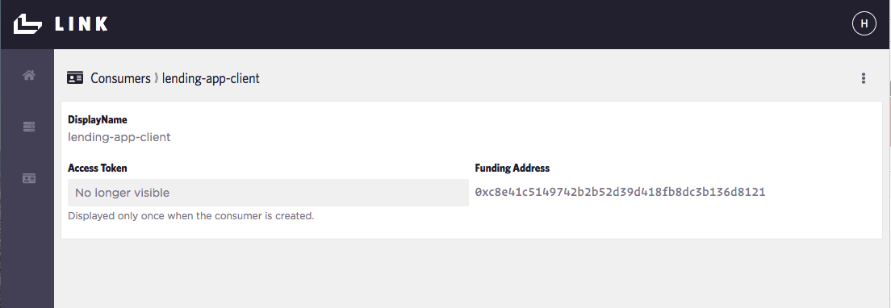

# Refactor your Lending DApp to use Blockmason Link
## Goal
In this activity, we will use Link - a smart contract API wrapper to refactor our Lending DApp.

## Exercise
This activity will require you to:
* Add your Lending smart contract to Link
* Refactor your app.js to use Link
* Compare and contrast the effort in building DApps using traditional web3js tools vs. Link

### Link Setup
> Obtain your Link invitation code

> Register with Link at https://mason.link

> We will use the Lending contract you deployed on the Ropsten test network. You will need to copy the hash address the contract was deployed at. If you can't find this, redeploy the contract from `activity3/lending-app` with:
```
    truffle migrate --reset --network ropsten
```
You will see an output that looks like this:
```
Using network 'ropsten'.

Running migration: 1_initial_migration.js
  Replacing Migrations...
  ... 0x3f504da27435d9240f1aa5e37edc6d6f89c2d983d217ef0b57fdb7b54ec34d64
  Migrations: 0xf3924335e08285721d2607e495ba7815133ace84
Saving successful migration to network...
  ... 0x3ead6009b860f403ba001c19828091ee4d29170f1d201fe7326a403d24bd413e
Saving artifacts...
Running migration: 2_deploy_contracts.js
  Replacing Lending...
  ... 0x6b673206fc8d0a4b919b634370f7019bf62d44a887f2b7cc11bd613da185318c
  Lending: 0xc980b32ed01fac955520f390fde005187c4acb8e
Saving successful migration to network...
  ... 0xfc423712b1a3a29c86801f52738187fbb1f405ade30e8484659694509d32a409
Saving artifacts...
```
The Lending contract address in this case is `0xc980b32ed01fac955520f390fde005187c4acb8e`.

> You will also need to copy the Lending contract ABI (https://solidity.readthedocs.io/en/develop/abi-spec.html) into Link which you can obtain from `activity3/lending-app/Lending.json`:
```
{
  "contractName": "Lending",
  "abi": [
    {
      "constant": true,
      "inputs": [],
      "name": "loansCount",
      "outputs": [
        {
          "name": "",
          "type": "uint256"
        }
      ],
      "payable": false,
      "stateMutability": "view",
      "type": "function"
    },
    ...
  ],
  "bytecode":
  ...

```
### App Setup
> In Link, create a new App called `lending-app` and copy the `Contract Address` and `Contract ABI` including the square brackets `[]`. You can also add in a description. 


This creates an app with 3 functions:


The first function is the `addLoan(...)` which takes in 5 parameters. Next we have the `loans` array which takes in a Loan ID parameter to retrive a Loan object. Finally, we have the `loansCount` variable which does not take in any parameters. 

### Consumers Setup
In Link, _consumers_ represent front-end apps, individuals or anything that will transact with the smart contract on the network. For this activity, create a `Lender app front-end` consumer which will be provided with a **Funding Address**. 



> Now this Funding Address needs some test ETH. Open up your MetaMask Account 1 on the Ropsten Test Network and transfer some ETH to your new Funding Address.


### Constructing the API Request